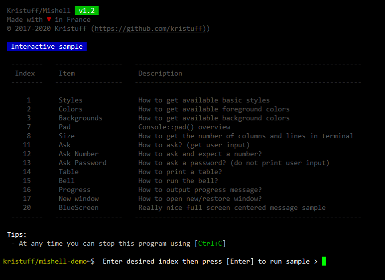

# Mishell 

> A mini PHP library to build beautiful CLI apps and reports

[](https://www.codacy.com/manual/kristuff_/mishell?utm_source=github.com&amp;utm_medium=referral&amp;utm_content=kristuff/mishell&amp;utm_campaign=Badge_Grade)
[](https://codeclimate.com/github/kristuff/mishell/maintainability)
[](https://scrutinizer-ci.com/g/kristuff/mishell/?branch=master)
[](https://scrutinizer-ci.com/g/kristuff/mishell/build-status/master)
[](https://packagist.org/packages/kristuff/mishell)
[](https://packagist.org/packages/kristuff/mishell)


- [Features](#features) 
- [Requirements](#requirements) 
- [Install](#install) 
- [Run the sample](#run-the-sample) 
- [Documentation](#documentation) *in progress...*
- [License](#license) 

Features
--------
- Writing methods:
    - Basic or colored/stylized text
    - Tables
    - Progress message
- Get user inputs
    - standard text input
    - hidden text input (no supported on Windows)
    - numeric values   
- Open new/restore 'window' (no supported on Windows)
- Run the bell

Requirements
------------
- PHP >= 5.6

Install
--------
Deploy with your project (in `composer.json`):
```
{
    ...
    "require": {
        "kristuff/mishell": ">=1.0-stable"
    }
}
```

Run the sample
--------


- clone this repo on github (*demo* and *doc* folders are excluded from dist)
    ```bash
    $ git clone https://github.com/kristuff/mishell.git
    ```
- go to mishell folder
    ```bash
    $ cd mishell
    ```
- install (it just builds autoloader, no dependencies)
    ```bash
    $ composer install
    ```
- run sample
    ```bash
    $ php demo/index.php
    ```

Documentation
--------
    
*in progress...*

1. [Overview](#1-overview)  
  1.1 [Working with styles](#11-working-with-styles)    
  1.2 [Known foreground colors](#12-known-foreground-colors)   
  1.3 [Known background colors](#13-known-background-colors)   
  1.4 [Known options](#14-known-options) 
2. [Api methods](#2-api-methods)     
    2.1 [Writing methods](#21-writing-methods)   
    2.2 [Text/layout builder methods](#22-text-layout-builder-methods)   
    2.3 [Misc](#23-misc)   


## 1. Overview

The lib consists of one class `\Kristuff\Mishell\Console` that contains mainly 3 types of methods:

- writing methods (normal or stylized/colorized text) : writes something
- stylized/colorized CLI text builder methods : returns a formated string      
- layout string builder methods (tables, padding) : returns a formated string

Basic Example:
```php
Use Kristuff\Mishell\Console;
$value = Console::askInt('Please enter a number > ');
if ($value !== false){
    Console::log('=> The value you entered is [' . Console::text($value, 'yellow') . ']');
}
```
### 1.1 Working with styles

To be more flexible, most writing/text/layout builder methods take an indefinite number of arguments called `[styles]` in this documentation. 
The arguments are analyzed as follows:

- First argument that matchs to a known foreground color is taken as foreground color.
- First argument that matchs to a known background color (when a foreground color is already defined) is taken as background color (you cannot use a background color without set explicitly foreground color before).   
- Other arguments that match to a known option are taken as options.

So except for background that should be after foreground, style arguments order does not matter. Just note that the `'none'` argument will reset any previous style arguments.

Examples:
```php
Use Kristuff\Mishell\Console;

Console::write('some text', 'blue');                                // writes a blue text 
Console::write('some text', 'bold');                                // writes a text style bold
Console::write('some text', 'blue', 'underline');                   // writes a blue underlined text  
Console::write('some text', 'blue', 'white');                       // writes a blue text on white
Console::write('some text', 'blue', 'white', 'underline');          // writes a blue text on white and style underline
Console::write('some text', 'blue', 'white', 'underline', 'bold');  // writes a blue text on white and styles underline+bold

// writes a blue text on white and style reverse (so => white on blue...)
Console::write('some text', 'blue', 'white', 'reverse');            

// writes a blue text on white and style underline 
// (except background after foreground, args order does not matter)
Console::write('some text', 'blue', 'white', 'underline');            
Console::write('some text', 'underline', 'blue', 'white');            
Console::write('some text', 'blue', 'underline', 'white');            

// Writes a text with no style at all (note the 'none' argument at the end...)
Console::write('some text', 'blue', 'underline', 'none');            
[...]
//Got it?
```

### 1.2 Known foreground colors

Name            |  ANSI Code 
--------------- | --------  
normal          | \033[39m       
black           | \033[30m  
gray            | \033[1;30m 
lightgray       | \033[37m  
white           | \033[1;37m  
blue            | \033[34m    
lightblue       | \033[1;34m  
green           | \033[32m     
lightgreen      | \033[1;32m   
cyan            | \033[36m     
lightcyan       | \033[1;36m    
red             | \033[31m     
lightred        | \033[1;31m     
magenta         | \033[35m       
lightmagenta    | \033[1;35m     
brown           | \033[33m       
yellow          | \033[1;33m     

### 1.3 Known background colors

Name            |  ANSI Code 
--------------- | --------  
black           | \033[40m 
red             | \033[41m 
green           | \033[42m 
yellow          | \033[43m 
blue            | \033[44m  
magenta         | \033[45m   
cyan            | \033[46m    
white           | \033[47m    

### 1.4 Known options

Name            |  ANSI Code 
--------------- | --------  
none            | \033[0m       
bold            | \033[1m 
underline       | \033[4m 
blink           | \033[5m 
reverse         | \033[7m 

## 2. Api methods
### 2.1 Writing methods

Method | Description | Return| Note
--- | --- | --- | ---
`Console::write($str, [styles])`        | Writes a [formatted] string in the console. | `void` |
`Console::log($str, [styles])`          | Writes a [formatted] string in the console with new line. | `void` |
`Console::reLog($str, [styles])`        | Writes or overwites the current line with a [formatted] string. | `void` |
`Console::ask($str, [styles])`          | Writes a [formatted] string in the console and waits for an input. Returns that input. |`string` |
`Console::askInt($str, [styles])`       | Writes a [formatted] string in the console and waits for an int input. | `int`&#124;`bool` |    
`Console::askPassword($str, [styles])`  | Writes a [formatted] string in the console and waits for an input. Returns but does not print user input. | `string` | **Not supported** on windows platform

### 2.2 Text/layout builder methods

Method | Description | Return | Note
--- | --- | --- | ---
`Console::pad(TODO)`                    | TODO      | `string` | 
`Console::tableRow(TODO)`               | TODO      | `string` | 
`Console::tableRowStart(TODO)`          | TODO      | `string` | 
`Console::tableRowEmpty(TODO)`          | TODO      | `string` | 
`Console::tableRowSeparator(TODO)`      | TODO      | `string` | 
`Console::tableRowCell(TODO)`           | TODO      | `string` | 
`Console::tableResetDefaults(TODO)`     | TODO      | `void`   | 


### 2.3 Misc

Method | Description | Return | Note
--- | --- | --- | ---
`Console::clear()`                      | Clear the console.                    | `void` |
`Console::bell()`                       | Play the bell if available.           | `void` |
`Console::newWindow()`                  | Switch to a new window                | `void` |
`Console::restoreWindow()`              | Restore the previous window           | `void` |
`Console::HideInput()`                  | Hide user input in window             | `void` | **Not supported** on windows platform
`Console::restoreInput()`               | Restore user input window             | `void` | **Not supported** on windows platform
`Console::getLines()`                   | Get the number of lines in terminal   | `int`  | **Not supported** on windows platform
`Console::getColumns()`                 | Get the number of colums in terminal  | `int`  | **Not supported** on windows platform

[...] TODO 
+ tables methods
+ enum styles
 ...

License
-------

The MIT License (MIT)

Copyright (c) 2017-2020 Kristuff

Permission is hereby granted, free of charge, to any person obtaining a copy
of this software and associated documentation files (the "Software"), to deal
in the Software without restriction, including without limitation the rights
to use, copy, modify, merge, publish, distribute, sublicense, and/or sell
copies of the Software, and to permit persons to whom the Software is
furnished to do so, subject to the following conditions:

The above copyright notice and this permission notice shall be included in
all copies or substantial portions of the Software.

THE SOFTWARE IS PROVIDED "AS IS", WITHOUT WARRANTY OF ANY KIND, EXPRESS OR
IMPLIED, INCLUDING BUT NOT LIMITED TO THE WARRANTIES OF MERCHANTABILITY,
FITNESS FOR A PARTICULAR PURPOSE AND NONINFRINGEMENT. IN NO EVENT SHALL THE
AUTHORS OR COPYRIGHT HOLDERS BE LIABLE FOR ANY CLAIM, DAMAGES OR OTHER
LIABILITY, WHETHER IN AN ACTION OF CONTRACT, TORT OR OTHERWISE, ARISING FROM,
OUT OF OR IN CONNECTION WITH THE SOFTWARE OR THE USE OR OTHER DEALINGS IN
THE SOFTWARE.
