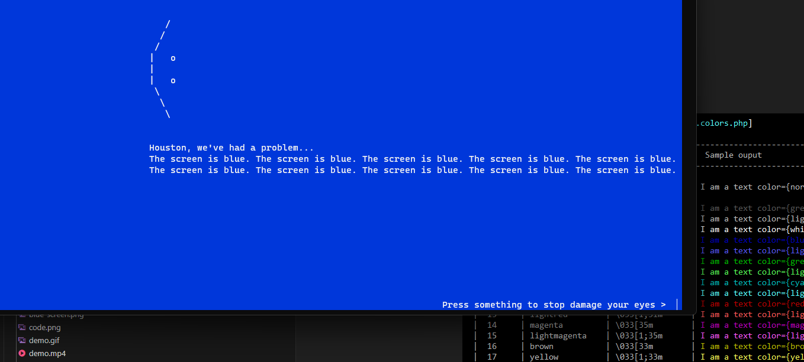

# Mishell 

> A mini PHP library to build beautiful CLI apps and reports

[](https://scrutinizer-ci.com/g/kristuff/mishell/build-status/master)
[](https://scrutinizer-ci.com/g/kristuff/mishell/?branch=master)
[](https://packagist.org/packages/kristuff/mishell)
[](https://packagist.org/packages/kristuff/mishell)

-   480 

- [Features](#features) 
- [Requirements](#requirements) 
- [Install](#install) 
- [Documentation](#documentation) 
- [Run the sample](#run-the-sample) 
- [License](#license) 

Features
--------
- Printing methods:
    - Basic or colored/stylized text ✔
    - Tables ✔
    - Progress message ✔
- Get user inputs
    - standard text input ✔
    - hidden text input ✔ (no supported on Windows)
    - numeric values  ✔ 
- Open new/restore 'window' ✔ (no supported on Windows)
- Run the bell ✔

Requirements
------------
- PHP >= 5.6
- PHP mbstring module


Install
--------

Deploy with your project (in `composer.json`):


```
{
    ...
    "require": {
        "kristuff/mishell": ">=1.6-stable"
    }
}
```

> Composer is (technically) required to build autoloader files. You should be able to run the demo "as is" (with the `vendor` directory included) when you clone the project. There is no other dependencies.


Documentation
--------

- [Project page](https://kristuff.fr/projects/mishell)
- [API documentation](https://kristuff.fr/projects/mishell/doc)   *in progress...*


Run the sample
--------


- clone this repo on github (*demo* and *doc* folders are excluded from dist)
    ```bash
    $ git clone https://github.com/kristuff/mishell.git
    ```
- go to mishell folder
    ```bash
    $ cd mishell
    ```
- install (it just builds autoloader, no dependencies)
    ```bash
    $ composer install
    ```
- run sample
    ```bash
    $ php demo/index.php
    ```

Bonus
-----
You can also do unuseful things like the blue screen of the death^^ Check the demo

 

Update ::1.6



License
-------

The MIT License (MIT)

Copyright (c) 2017-2024 Kristuff

Permission is hereby granted, free of charge, to any person obtaining a copy
of this software and associated documentation files (the "Software"), to deal
in the Software without restriction, including without limitation the rights
to use, copy, modify, merge, publish, distribute, sublicense, and/or sell
copies of the Software, and to permit persons to whom the Software is
furnished to do so, subject to the following conditions:

The above copyright notice and this permission notice shall be included in
all copies or substantial portions of the Software.

THE SOFTWARE IS PROVIDED "AS IS", WITHOUT WARRANTY OF ANY KIND, EXPRESS OR
IMPLIED, INCLUDING BUT NOT LIMITED TO THE WARRANTIES OF MERCHANTABILITY,
FITNESS FOR A PARTICULAR PURPOSE AND NONINFRINGEMENT. IN NO EVENT SHALL THE
AUTHORS OR COPYRIGHT HOLDERS BE LIABLE FOR ANY CLAIM, DAMAGES OR OTHER
LIABILITY, WHETHER IN AN ACTION OF CONTRACT, TORT OR OTHERWISE, ARISING FROM,
OUT OF OR IN CONNECTION WITH THE SOFTWARE OR THE USE OR OTHER DEALINGS IN
THE SOFTWARE.
