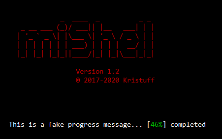

=================

Kristuff miShell 

A mini PHP CLI app builder

[](https://www.codacy.com/app/kristuff_/mishell?utm_source=github.com&amp;utm_medium=referral&amp;utm_content=kristuff/patabase&amp;utm_campaign=Badge_Grade)
[](https://codeclimate.com/github/kristuff/mishell)

[Features](Features) 
[Requirements](Requirements) 
[Install](Install) 
[Documentation](Documentation) (extrenal file) 
[License](License) 


Features
--------
- Colorized shell writing methods:
    - Basic or colored/stylized text
    - Tables
    - Progress message
- Get user inputs
    - standard (text) input
    - password (hidden input)
    - numeric values   
- Open new/restore 'window' (no supported on Windows)
- Run the bell

Requirements
------------
- PHP >= 5.6

Install
--------
- Deploy with your project (in `composer.json`):
```
{
    ...
    "require": {
        "kristuff/mishell": "0.*"
    }
}
```

- From command line:
```bash
composer require kristuff/mishell
// or clone this project if wou want to play with the demo
// git clone https://github.com/kristuff/mishell.git
cd mishell
composer install
```


Documentation
--------


-  `Console::text($str, [styles])`  
    Gets a formatted string to be returned in the console 
    
    Returns `string`
-  `Console::log($str, [styles])`   
    Writes a formatted string in the console with new line
    
    Returns `void`
-  `Console::reLog($str, [styles])`
    Writes or overwites the curren line.
    
    Returns `void`
-  `Console::ask($str, [styles])`   
    Writes a formatted string in the console and waits for an input.

    Returns `string`
-  `Console::askInt($str, [styles])` 
    Writes a formatted string in the console and waits for an int input.
    Returns `int`|`bool`    


License
-------

The MIT License (MIT)

Copyright (c) 2017 Kristuff

Permission is hereby granted, free of charge, to any person obtaining a copy
of this software and associated documentation files (the "Software"), to deal
in the Software without restriction, including without limitation the rights
to use, copy, modify, merge, publish, distribute, sublicense, and/or sell
copies of the Software, and to permit persons to whom the Software is
furnished to do so, subject to the following conditions:

The above copyright notice and this permission notice shall be included in
all copies or substantial portions of the Software.

THE SOFTWARE IS PROVIDED "AS IS", WITHOUT WARRANTY OF ANY KIND, EXPRESS OR
IMPLIED, INCLUDING BUT NOT LIMITED TO THE WARRANTIES OF MERCHANTABILITY,
FITNESS FOR A PARTICULAR PURPOSE AND NONINFRINGEMENT. IN NO EVENT SHALL THE
AUTHORS OR COPYRIGHT HOLDERS BE LIABLE FOR ANY CLAIM, DAMAGES OR OTHER
LIABILITY, WHETHER IN AN ACTION OF CONTRACT, TORT OR OTHERWISE, ARISING FROM,
OUT OF OR IN CONNECTION WITH THE SOFTWARE OR THE USE OR OTHER DEALINGS IN
THE SOFTWARE.
